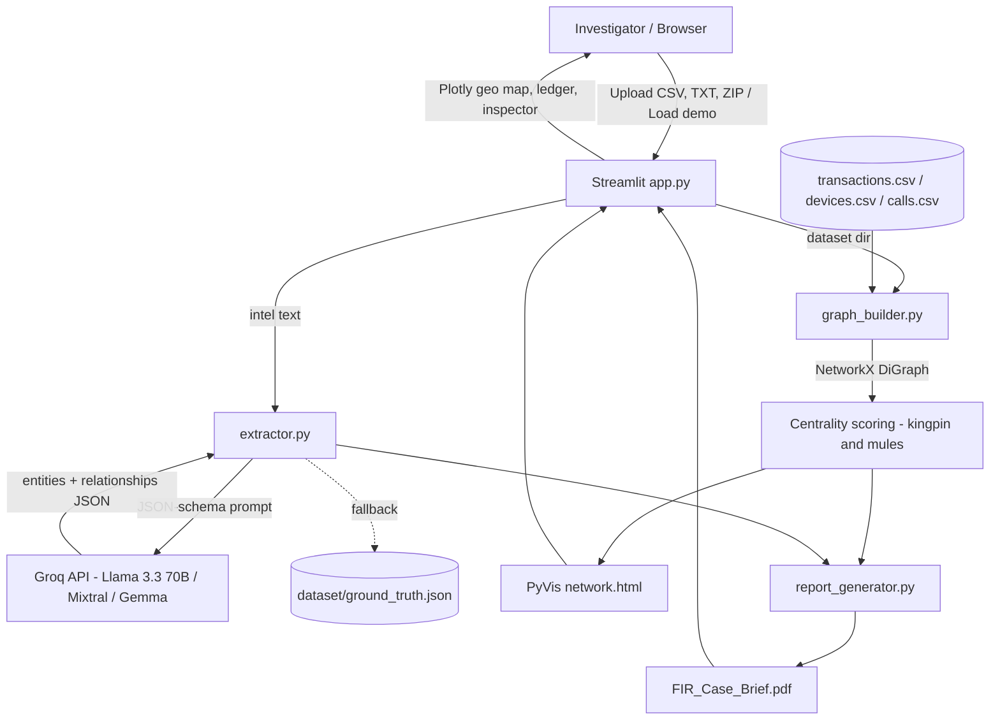

# Architecture

## System Architecture

Cyber-Tracer Pro is a single-process Python application. Streamlit provides the UI and orchestrates three modules: LLM extraction, graph analytics and report generation. All state lives in the Streamlit session; case data is read from CSV/TXT files on disk.

## Components

| Component | Technology | Responsibility |
|---|---|---|
| UI / orchestration | Streamlit (`app.py`) | File ingestion, run controls, KPI strip, five analysis tabs, downloads |
| Entity extraction | Groq Python SDK (`extractor.py`) | Convert unstructured intel into entity/relationship JSON; model fallback chain |
| Graph engine | NetworkX, Pandas (`graph_builder.py`) | Build directed graph from transactions, IMEI links and calls; compute centrality scores |
| Network visualisation | PyVis / vis.js (`graph_builder.py`, `lib/`) | Interactive, role-coloured network HTML |
| Geospatial view | Plotly `Scattergeo` (`app.py`) | Per-entity routing trace across Indian cities / cell towers |
| Report generation | ReportLab (`report_generator.py`) | Statutory FIR case brief PDF |
| Data | CSV / TXT / JSON (`dataset/`, `cyber_fraud_mock_dataset/`) | Synthetic case data and ground truth |

## Data Flow

1. The investigator uploads case files (or uses the bundled demo case). ZIPs are extracted into `cyber_fraud_mock_dataset/`; a `.txt` replaces `dataset/unstructured_intel.txt`.
2. `extract_intel_from_file()` sends the intel text to Groq and parses the JSON response (falling back to `ground_truth.json` on failure).
3. `build_fraud_network()` reads transactions (sender → receiver with amount), devices (account → IMEI) and call logs (caller → callee) into one `nx.DiGraph`.
4. `detect_kingpins_and_mules()` scores every node as `0.6·betweenness + 0.4·in-degree` and returns the kingpin and top mule accounts.
5. `export_pyvis_html()` renders the graph; `generate_fir_pdf()` writes the case brief using the graph and extracted entity names.
6. Results are cached in `st.session_state` and shown across the Network Graph, Geospatial Map, Entity Ledger, Suspect Inspector and Statutory Brief tabs.

## Security Considerations

- The Groq API key is read from the `GROQ_API_KEY` environment variable or `src/.env`; `.env` is git-ignored and no key is committed.
- Only synthetic data is bundled; no real personal, telecom or banking data is included.
- The prototype has no authentication and writes uploads to local folders — a deployment would need access control, per-case isolation and audit logging.

## Scalability Notes

Betweenness centrality is O(V·E) and is the bottleneck on large graphs; a production version would use approximate (sampled) betweenness or a graph database (e.g. Neo4j) with incremental updates. LLM extraction is per-document and can be batched or parallelised. The Streamlit front-end could be split from a stateless API backend to support multiple investigators.
